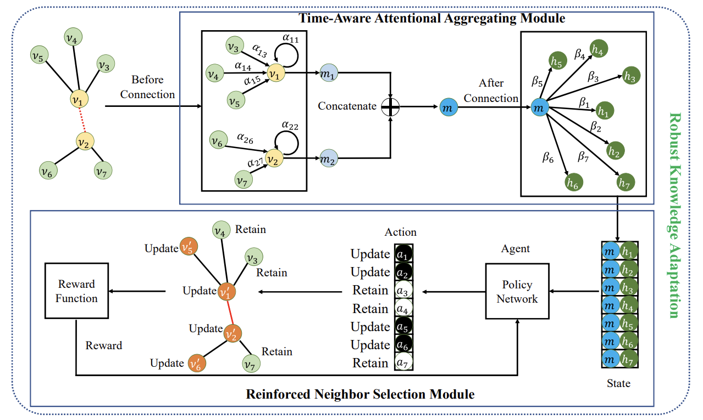

# Dada-DyGNN: Deletion-Augmented Streaming GNNs

## Introduction

This repository contains the code for Dada-DyGNN, a deletion-augmented dynamic graph neural network. The codebase is built on-top of existing open-source code by Li et al., in Ada-DyGNN (TKDE 2024).



## Datasets

Please refer to [DyGNN](https://github.com/alge24/DyGNN) for downloading the UCI dataset, and our implementation for generating the preferential attachment dataset.

```
python pref-att.py
```

## Training


Train the model for the MRR evaluation with:

```
python trainMRR.py
```
